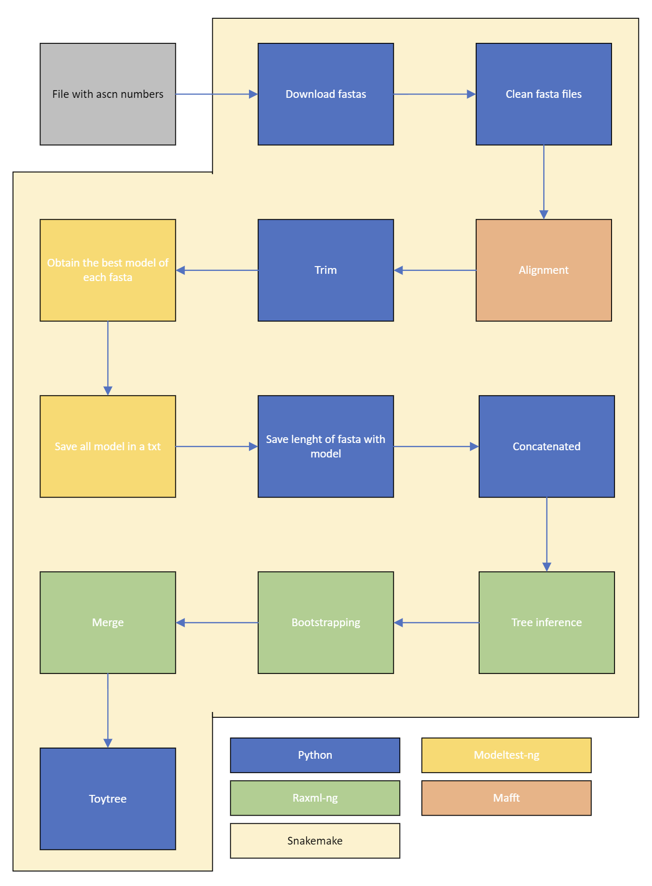

# Phylo Flow 

## Description
This tool, developed within the scope of ASB, aims to create a pipeline.



## Requisites
* txt files with genes;
* Python;
* Mafft;
* modeltest-ng;
* raxml-ng;
* Toytree.

### TxT gene files
```bash
#TxT formart
Sequence_name;ascn_number

#Example
Paramacrobiotus_gadabouti_sp._nov._MD50.1;OP394210
```
## Installation
```bash
# Download the project from GitLab
wget https://github.com/Rendrick27/Assignment_01/archive/refs/heads/main.zip

# Unzip the folder
unzip Assignment_01-main.zip
```
Then copy your .txt files into ascn folder.

## Usage
```bash
# Navigate to the Snakemake directory
cd Assignment_01-main.zip
```
Then, run the following command:
```bash
snakemake --use-conda all --cores 1
```

## Docker
### Build it
```bash
docker build -t {image_name} .

docker run -it --name {container_name} {image_name} /bin/bash
```
### Pull docker image
```bash
docker pull rendrick27/phylo_flow:latest
```

## Settings
You may adjust settings in the Snakemake file, such as threads and bootstraps in params, but remember that using more threads may cause more issues.

## Credits
<p> <a href= "https://github.com/Rendrick27"> Rendrick Carreira - 201901365 </a> </p>

## License
GPLv3
